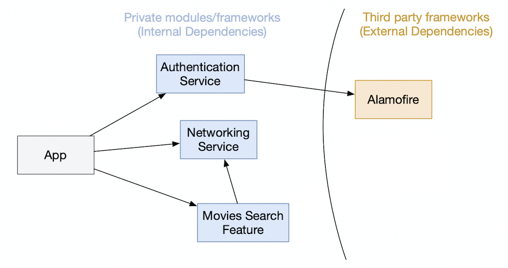
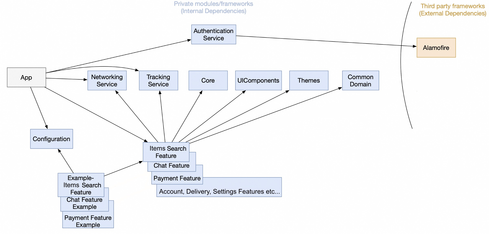
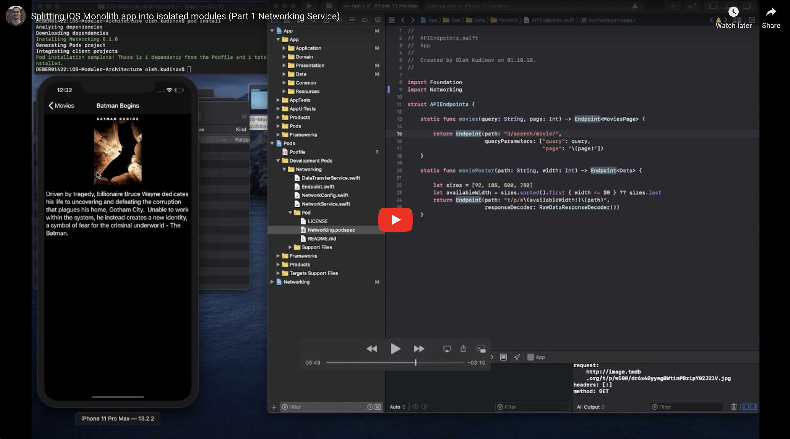
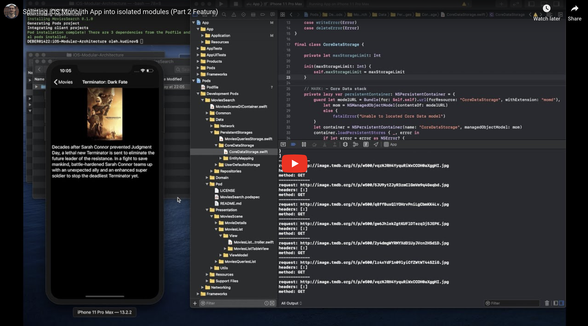

# Modular Architecture on iOS &nbsp; [](https://travis-ci.com/github/kudoleh/iOS-Modular-Architecture)

iOS Project implemented with Modular Architecture. (Can be used as Template project by replacing item name “Movie”). **More information in medium post**: <a href="https://tech.olx.com/modular-architecture-in-ios-c1a1e3bff8e9">Medium Post about Modular Architecture</a>


*More information in medium post*: <a href="https://tech.olx.com/modular-architecture-in-ios-c1a1e3bff8e9">Medium Post </a>

# Including Authentication module (initial scaling)

<a href="http://www.google.com">

</a>

*More information in medium post*: <a href="https://tech.olx.com/modular-architecture-in-ios-c1a1e3bff8e9">Medium Post </a>

# How it can scale:

<a href="http://medium.com">

</a>

**Check medium post for more information**: <a href="https://tech.olx.com/modular-architecture-in-ios-c1a1e3bff8e9">Medium Post </a>

## Video 1: Extracting Networking Service Module. <a href="#steps-to-create-module">see steps</a>
<a href="https://www.youtube.com/embed/e2D-omTFJSA">

</a>

## Video 2: Extracting Movies Search Feature Module. <a href="#steps-to-create-module">see steps </a>

<a href="https://www.youtube.com/embed/m1lu_23iV78">

</a>

## Requirements: 
* **Xcode Version 11.2.1+  Swift 5.0+ CocoaPods 1.8.4+**

# Steps to create module
* **Step 1. Setup App project with CocoaPods: (Video 1 00:06)**
	* Open Terminal and change directory `cd` to folder with your project App.xcodeproj file, and execute following commands:
		* `pod init` 
    	* inside Podfile 
    		* uncomment `platform :ios, '9.0'`,  and change `'9.0'` to `10.0` or `11.0`
    		* add line: `workspace 'AppName.xcworkspace'`
    		* add line: `project 'AppName.xcodeproj'`
    	* `pod install` 
* **Step 2. Create new Module with CocoaPods: (Video 1 00:48)**
	* In the same folder from previous step create a new folder with name `DevPods`: 
		* `mkdir DevPods` 
	* Create New Module inside `DevPods` folder:
		* `cd DevPods`
		* `pod lib create ModuleName`
		* with Platform: `iOS`; Language: `Swift`; Include a Demo App: `Yes`; Test framework and view based testing we can skip

		Note: To use your own pod-template you can add the parameter `--template-url=URL` where URL is the git repo containing a compatible template.
* **Step 3. The Module's Example Demo project will be opened automatically, we need to update iOS and Swift versions: (Video 1 01:27)**
	* Select example project and set `In Deployment Info` to `iOS 10.0` or `iOS 11.0`
	* In Build Settings search for `Swift` and set Swift Language Version to `Swift 5`. 
	* Remove Test Target and Test folder inside the project
	* Close this demo example project (otherwise you will not be able to open it from App.xcworkspace)
* **Step 4. Cleaning up `DevPods/ModuleName` folder: (Video 1 01:48)** 
	 * Show hidden files with `Cmd + Shift + .` and delete files: `.git`, `.gitignore` and `.travis.yamls`
	* Delete files: `_Pod.xcodeproj`, `Example/Podfile`, `Example/Podfile.lock`, `Example/Pods`, `Example/ModuleName.xcworkspace`
* **Step 5. Edit Podfile of project located in same folder as app's project App.xcworkspace file: (Video 1 02:10)** 

	* Add `module_name_pod` inside Podfile:
	
		```ruby
		def module_name_pod
		    pod 'ModuleName', :path => 'DevPods/ModuleName'
		end
		```
	* Move nested test targets outside target 'App':
	
		```ruby
		target 'App' do
		...
		end

		target 'AppTests' do
			inherit! :search_paths
		end
		
		target 'AppUITests' do
		end
		```
	* Add module's example target so we can develop this module from same main App's workspace:

		```ruby
		target 'ModuleName_Example' do
			use_frameworks!
			project 'DevPods/ModuleName/Example/ModuleName.xcodeproj'
			
			module_name_pod
		end
		```
* **Step 6. Move files from main App into Module's Pod: (Video 1 03:14)**
	* Inside `DevPods/ModuleName/ModuleName` folder remove `Assets` and `Classes` folders and create folder with name `Module`. 
	* Move from main App to the `Module` folder all module's files (e.g. .swift, .xcassets, .storyboard, .xcdatamodeld...). After moving them from main App do not forget to delete them also from main App's target. For moving files is better to not use Xcode, and do it manually or with terminal.
        * Edit ModuleName.podspec:
			* Set ios deployment target: `s.ios.deployment_target = '10.0'` or `11.0`

            * Replace `s.source_files = ...`  to: **(Video 1 03:53)**

	            ```ruby
	            s.source_files = 'MoviesSearch/Module/**/*.{swift}'
	            s.resources = "MoviesSearch/Module/**/*.{xcassets,json,storyboard,xib,xcdatamodeld}"
	            ```
	            **Note**: if you have Core Data model with `xcdatamodel` extension you will need to convert it into `xcdatamodeld` by selecting this file and `Editor or Help -> Add Model Version..`
	            
	            **Note**: when you create new Group inside `Development Pods/ModuleName` with Xcode, it places its folder in wrong place outside of `Module` (pod folder). And it needs to be moved manually into `Module` folder using Finder, and then `pod install`

* **Step 7. Add all internal or external dependencies for this module. Add them inside `ModuleName.podspec` file located inside `DevPods/ModuleName` folder: (Video 2 03:33)**

        # internal dependency (module you have created before)
        s.dependency 'ModuleName2' 

        # external dependency 3rd party framework 
        s.dependency 'PromiseKit'
**Note**: If you have not yet extracted your dependency and you need it here you can delegate this functionality to main App. Just create interface using protocol and implement it inside 
your main App. For example if you need to open chat from your module, then create protocol interface inside your module with function openChat(forUserId:inView:) and then implement it inside main App, and it will be injected from main App into DIContainer of the module.
Also closures or delegation can be used. 

* **Step 8. After `pod install` and compiling main App we will see some errors that we have to fix: (Video 2 03:45)**
	* Inside main app, add `import ModuleName` in all files where it is needed
    * Change to public all types or functions that needs to be accessed from outside of the module, from main app or other module
    * Change all resources initialisers to initialise them with module's bundle (e.g. images, storyboards, nibs or CoreData models xcdatamodeld): **(Video 2 05:15)**
    
        ```swift
        // Image load from bundle
        UIImage(named: "image_name", in: Bundle(for: Self.self), compatibleWith: nil)
        // Image Literal
        final class LiteralBundleImage: _ExpressibleByImageLiteral {
    		let image: UIImage?
    		required init(imageLiteralResourceName name: String) {
        		image = UIImage(named: name, in: Bundle(for: Self.self), compatibleWith: nil)
    		}
		}
		let image = (#imageLiteral(resourceName: "image_name") as LiteralBundleImage)
        
        // Storyboards and Nibs load from bundle
        UIStoryboard(name: "name", bundle: Bundle(for: Self.self))
        UINib(nibName: "name", bundle: Bundle(for: Self.self))
        
        // Core Data model load from bundle
        guard let modelURL = Bundle(for: Self.self).url(forResource: "ModelFileName", withExtension: "momd"),
              let mom = NSManagedObjectModel(contentsOf: modelURL)
              else {
                    fatalError("Unable to located Core Data model")
        }
        let container = NSPersistentContainer(name: "Name", managedObjectModel: mom)
    ```
        Note: the file must have .xcdatamodeld extension, to convert it from xcdatamodel extension just Add Model Version..
        
* **Step 9. Move Module's tests from main App into module's Pod: (Video 2 07:20)**
    * Crete folder with name `Tests` inside  `DevPods/ModuleName/ModuleName/`
    * Move all files with tests from main App folder to `DevPods/ModuleName/ModuleName/Tests`.  **Note**:  Move them manually or using terminal, avoid doing it directly with Xcode groups.
    * Add to ModuleName.podspec:
    
        ```ruby
        s.test_spec 'Tests' do |test_spec|
            test_spec.source_files = 'ModuleName/Tests/**/*.{swift}'
        end
        ```

    * Add to main App's Podfile module's pod `, :testspecs => ['Tests']`

        ```ruby
        def module_name_pod
        	pod 'ModuleName', :path => 'DevPods/ModuleName', :testspecs => ['Tests']
        end
        ```
        * Add to all unit tests files imports: `@testable import ModuleName`
        * Run in terminal `pod install` for main App Podfile
        * To make our Module's unit test app to run unit test with `Cmd + U` from main App schema:
        * Edit schema `ModuleName-Example`, inside Test section, add unit tests from Pod: `under Pod -> ModuleName-Unit-Tests`
* **Step 10. Fix ModuleName-Example schema used for developing module in isolation: (Video 2 09:45)**
    * Switch from main App schema to ModuleName-Example schema and try to build
    * **Note**: AppDelegate method will have some warning and error that we have to fix, you can just copy paste it form main App
* **Step 11. To make our Module's Example app to run unit test with `Cmd + U`, we follow the same step as we did for main App: (Video 2 10:10)**
    * Edit schema `ModuleName-Example`, inside Test section, add unit tests from Pod: `under Pod -> ModuleName-Unit-Tests`
    
# Module as Static Library [Optional]: 

* Change your modules to be as Static Libraries (We made it as <a href="https://developer.apple.com/library/archive/documentation/DeveloperTools/Conceptual/DynamicLibraries/100-Articles/OverviewOfDynamicLibraries.html">Dynamic Library</a> in previous steps):
	 * Remove from main App's Podfile: `use_frameworks!`
    * Replace `s.resources` with `s.resource_bundles` in all modules' .podspec files (ModuleName.podspec):
    <br>**Note**: `resource_bundles` has different structure: `'ModuleName' => [ ... ]`, where `'ModuleName'` is bundle name:
    
        ```ruby
        s.resources = 'ModuleName/Module/**/*.{xcassets,json,storyboard,xib,xcdatamodeld}'
        ```
        
        Replace `s.resources` with: 
        
        ```ruby
        s.resource_bundles = {
   			'ModuleName' => ['ModuleName/Module/**/*.{xcassets,json,storyboard,xib,xcdatamodeld}']
  		}
        ```

    * Replace all `Bundle(for: Self.self)` appearances with call to extension: `Bundle(for: Self.self).resource`

        ```swift
         extension Bundle {
		     var resource: Bundle {
		        return Bundle(url: resourceURL!.appendingPathComponent("ModuleName.bundle"))!
		     }
		 }
        ```
	* If you have CoreData inside a module then open .xcdatamodeld file and change `Codegen` to `Manual/None` and `Create NSManagedObject Subclass..` for all entities
	
# Module's Testing in CI/CD [Optional]: 

* To keep always our modules buildable we need to build and run tests for each module on our Pipeline in CI. As example we can use [Fastlane](https://docs.fastlane.tools/actions/scan/) and [Travis CI](https://travis-ci.org/):
	
	* [Fastlane script](fastlane/Fastfile)

		```ruby
		lane :test do |options|
		
		  # Check if all modules are buildable
		  all_modules_schemes.each do |s|
		    UI.message "Testing if module #{s} is buildable"
		    scan(
		      scheme: s,
		      device: simulator,
		      build_for_testing: true,
		    )
		  end
			
		  # Run all unit and UI tests, and test if App is buildable
		  scan(
		    scheme: "App",
		    device: simulator,
		  )
			
		end
		```
	* [Travis CI script](.travis.yml)	
		  
		```ruby
		os: osx
		osx_image: xcode11.2
		language: swift
		script:
		- fastlane test
		```

**Check medium post for more information**: <a href="https://tech.olx.com/modular-architecture-in-ios-c1a1e3bff8e9">Medium Post </a>
